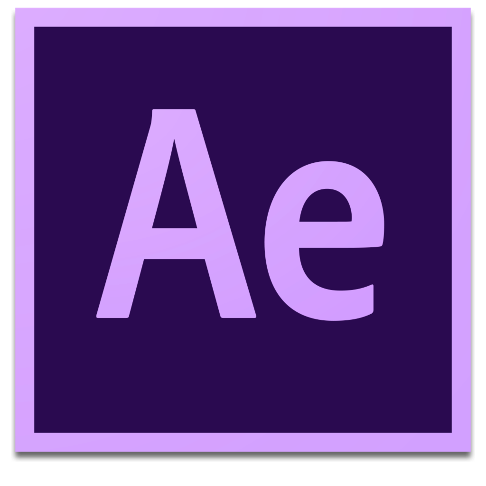

<h1 align="center">
  
   
   
  After Effects Resources
</h1>

<h4 align="center">Repository with useful design resources</h4>

  
  
  

#### Resources

A curated list of awesome After Effects resources.

##### Motion Design

*
[Sketch2AE]()
* [Bodymovin](https://www.invisionapp.com/inside-design/design-resources/free-wireframe-kit-form/) by Hernan Torrisi

##### Hand Off

* [Inspector SpaceTime](https://google.github.io/inspectorspacetime/) by Adam Plouff

#### Code Style

#### License

All trademarks and copyrights are property of their respective owners.
